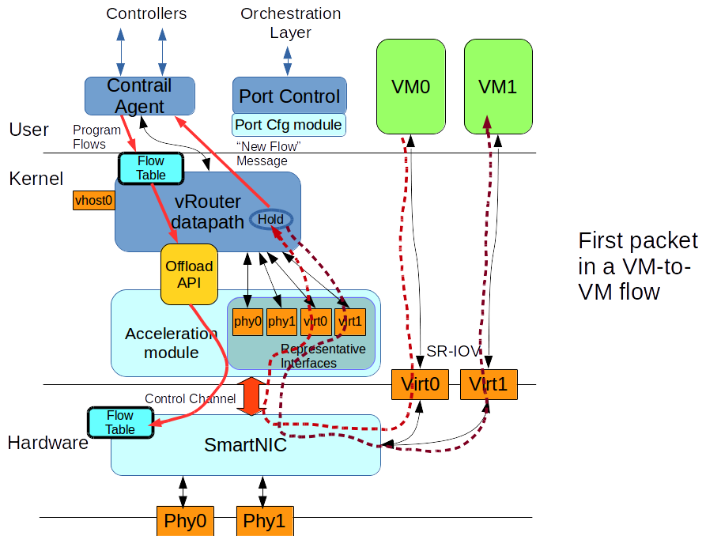
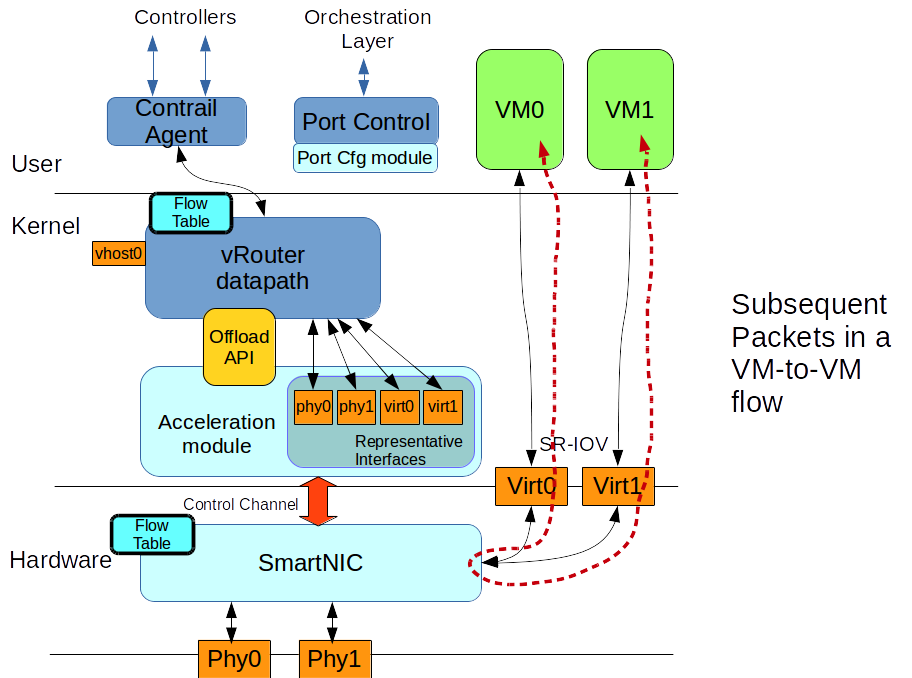
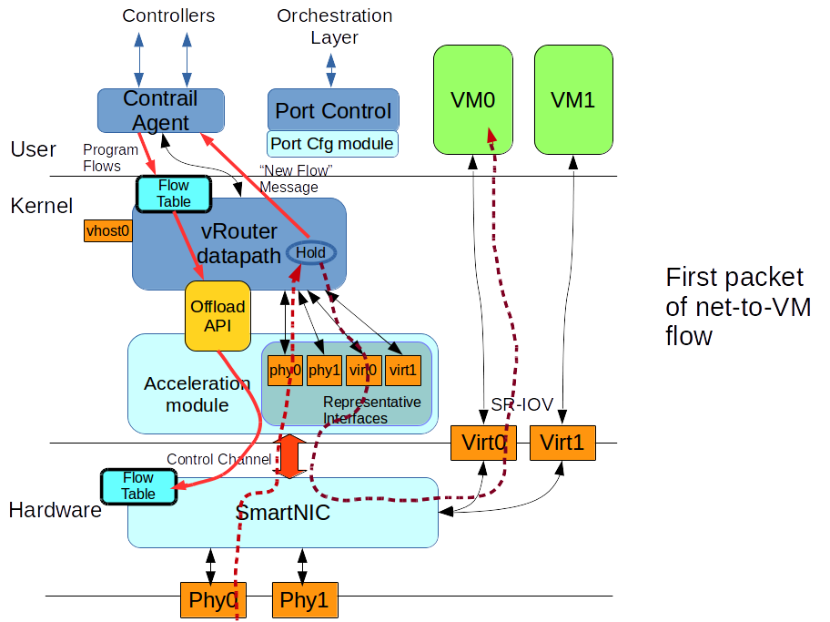
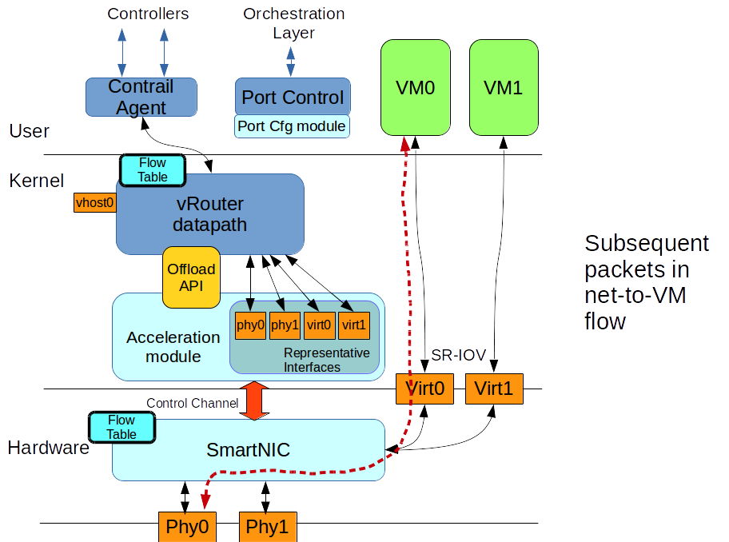

#1. Introduction

The purpose of this blueprint is to outline the design of enhancements
to the OpenContrail vRouter datapath for supporting hardware offload
to a SmartNIC.

#2. Problem statement

The vRouter datapath is a body of portable software that routes,
switches and modifies packets in an OpenContrail managed compute node.
It processes packets arriving from both physical interfaces (connected
to the underlay network) and virtual interfaces (connected to VMs).
Packets traversing the vRouter datapath are subject to decapsulation,
flow lookup, mirroring, modification, and encapsulation before delivery.
The datapath is designed to be highly performant while being able to
react to changing network configurations.

It is challenging to scale this datapath to meet the performance
requirements of bleeding edge datacenters built on 25 - 100 GBps NICs
and containing high speed VNFs.  The most performant solution to date
requires using DPDK-vRouter and dedicating a substantial number of
server cores to the task.  An alerternative approach is to employ a
SmartNIC such as those from Netronome's Agilio series to perform the
primary forwarding operations of the vRouter datapath.  SmartNICs can
communicate directly with hosted VMs using either SR-IOV VFs or through
VirtIO proxies.  They require few to no dedicated cores for forwarding
while improving overall performance.

#3. Proposed solution

The SmartNIC accelerated vRouter architecture includes four important
components:

  1. an acceleration offload API in the vRouter datapath
  2. an acceleration module that implements the offload API
  3. a set of representative interfaces that correspond to hardware
     interfaces both physical and virtual
  4. a port configuration module to manage representative, physical
     and virtual interface configuration

This blueprint will primarily describe item #1 above.  The structure of
items #2 and #3 above will, by nature,  be specific to the hardware
employed to accelerate vRouter.  Item #4 will have its own blueprint,
although this document will outline its purpose and place.  The
following figure highlights the basics of this design.

The goal is of this design is to allow the SmartNIC to handle most of
the traffic forwarding on the compute node without requiring the
SmartNIC to handle all of it.  A SmartNIC is usually able to DMA packets
directly into and out of VM address space.  This avoids packet copying
and metadata allocations that consume host processing resources.
However, a SmartNIC often also has resource limitations that the
host-based dataplane does not.  So the goal of this design is not to
*replace* the host datapath, but rather *offload* it.  If at any point,
the SmartNIC can not handle some aspect of the vRouter processing, it
should pass the packet unmodified through to the vRouter datapath for
processing.  We call this "falling back" to the host datapath.

For example, a host dataplane will generally have more memory for
buffering and for tables than a SmartNIC.  With this approach, if the
SmartNIC tables overflow, the SmartNIC can always fall back to the host
datapath any time it receives a packet that misses in the appropriate
table lookup.  (Note that this doesn't work for all table types: missing
an entry in an LPM lookup table would also mean an erroneous result.)
This design also accounts for the fact that the host datapath is more
capable of decoding and interpreting the sandesh-encoded messages that
the vRouter agent uses to communicate.

In this design, the vRouter datapath must be able to function correctly
despite the fact that it does not have direct access to either the
physical network interfaces (physical interfaces) nor the host VM
interfaces (virtual interfaces).  In order to account for this
difference in packet handling given the presence of SmartNICs, an
acceleration module must provide pseudo-interfaces that "represent" the
hardware SR-IOV-based virtual interfaces and physical interfaces.  These
pseudo-interfaces are called "representative interfaces".  Whenever the
host vRouter datapath sends a packet to a representative interface, the
interface forwards the packet to the SmartNIC with in such a way that
directs the SmartNIC to forward the packet to the corresponding outgoing
interface.  Similarly, when the SmartNIC needs to forward a packet to
the host vRouter so as to appear as if the packet arrived on a physical
or virtual interface, the SmartNIC sends the packet through the incoming
interface's corresponding representative interface on the host to the
vRouter datpath.

When a VM sends the very first packet of a flow, the SmartNIC will
receive that packet over an SR-IOV VF in the SmartNIC.  The SmartNIC
will attempt to forward the packet.  However, while doing so it will
determine that there is no flow entry in the SmartNIC's flow table that
matches this packet.  Now the vRouter datapath would ordinarily do the
following for such packets:

 * identify a new flow entry for the packet and place it in a "hold"
   state
 * enqueue the packet in a small (3 entry) queue that it associates with
   the flow
 * send a message to the vRouter agent providing details about the
   packet

However, SmartNICs often have more limited buffering capacity than the
host and may not be able to hold onto packet buffers for extended
periods of time.  Furthermore, the SmartNIC is not aware of whether the
host vRouter will be able to insert the flow into its own flow table.
Therefore, the SmartNIC forwards the packet across the virtual
interface's corresponding representative interface to the vRouter
datapath.  The vRouter datapath would then process the packet as just
mentioned without requiring any information or state from the SmartNIC.

On receipt of the vRouter datapath's message indicating a new flow, the
vRouter agent then determines how the vRouter datapath should handle
packets in that flow.  This involves consulting applicable ACLs for
policy lookup as well as potentially other types of lookups such as
might be related to provisioning or utilization.  The agent, then
programs two entries in its own flow table The first entry is for the
original flow that the datapath flagged.  The second entry is for the
reverse flow.  Finally, the agent sends a message to the vRouter
datapath to indicate that it should noting the creation of these two
new flows.

In this example, lets say that that the new flow carries traffic from
one VM to another VM on the same machine.  The vRouter datapath receives
the agent's notification of the flow state change and also sees that it
is holding packets for that flow.  However, before it can take further
action, the it invokes the acceleration offload hooks which send a
message to the SmartNIC informing it that it needs to install new flow
entries into its flow state table.  After this occurs, the host vRouter
datapath releases the held packets and performs the regular forwarding
operation for that packet.

Now, assuming that the flow table allows the packet to pass and assuming
that the routing and forwarding tables indicate that the packet is
destined for a virtual interface on the same compute node, the vRouter
datapath sends the packet to that interface.  However, the vRouter
datapath does not have direct access to the virtual interface of the VM.
So what it is really doing is sending the packet to a representative
interface that forwards packets to the SmartNIC along with information
indicating that the SmartNIC should send the packet to the actual
virtual interface.  When the SmartNIC receives the message, it strips
the packet of accompanying metadata and forwards the packet to the
virtual interface immediately without further processing.

It is noteworthy that the vRouter datapath requires no changes to
forward packets through the SmartNIC in this manner.  A properly
constructed fallback path uses the host operating system's or host
dataplane's normal interface abstractions for the representative
interfaces.  The representative interfaces look like normal
interfaces to the vRouter datapath.

The subsequent packets in a flow, whether they come from the client or
server VM would follow a much more abbreviated path.  A packet in the
same flow would arrive on an SR-IOV interface as before.  However, the
SmartNIC would now see a hit when it performed the flow lookup and would
therefore be able to forward the packet directly to its appropriate
destination.

Traffic that must traverse the underlay network follows a very similar
set of processing steps.  In fact, from the perspective of packet flow,
the only difference between how a vRouter handles a first packet
destined for a VM on the same system and a first packet destined for a
VM on a remote system is how that first packet leaves the system after
the vRouter datapath releases it.  For our second example, therefore, we
show packet processing for a new flow where the first packet comes in
over the underlay network.

In this case, upon packet arrival, the SmartNIC will determine that the
packet is arriving on a tunnel that it knows about and will decapsulate
the packet.  It will then perform a flow lookup on the inner packet
headers and at this point determine that it has no flow entry for this
packet.  The SmartNIC will then forward the packet to the vRouter
datapath to determine what to do with the packet.  The vRouter datapath
will behave as it did with VM-to-VM traffic, allocating a flow entry,
holding the packet and notifying the agent of the new flow.  Again, the
acceleration offload hooks will tell the SmartNIC to install new flow
entries just as they did in the in the VM-to-VM case.  The vRouter
datapath will then send the packet to a representative interface
corresponding to a virtual interface which will ultimately route the
packet through the SmartNIC for delivery to the virtual machine.

After this, the SmartNIC will forward packets from that flow directly
between the physical interfaces and the virtual interfaces in the
system.  Naturally, when transmitting a packet over a physical
interface, the vRouter will first encapsulate the packet in a tunnel.
Similarly, it will decapsulate packets arriving on the physical
interface before performing the lookups, including the flow lookup, that
direct the packet to the destination VM.

The general structure of the datapath offload API will be as follows.
Each vRouter datpath will maintain a pointer to a single instance of a
hardware acceleration offload data structure.  This data structure will
contain a series of possibly NULL pointers to callback functions that
the vRouter datapath must invoke at appropriate points in its code.
Each callback roughly corresponds to a type of message between the
vRouter agent and the vRouter datapath.  So there would be, for example,
callbacks for reset, and querying statistics.  There would also be
callback for adding and deleting flows, interfaces, routes, MPLS labels,
VXLAN VNIDs, mirror table entries, next hops, and so forth.

Whenever the vRouter datapath performs such an operation, it checks
whether the appropriate function callback pointer is non-NULL and if so
invokes it before completing the operation.  If the function pointer is
populated and the vRouter datapath invokes it, then the datapath must
also check the return code from the operation to determine whether there
were any errors with the offload processing.  If there were, it must
react as appropriate for the type of operation.  In general, a robust
acceleration module should avoid returning error conditions even if the
operation causes the hardware capacity to be exceeded.  It should
probably only return an error if the operation attempts to perform a
configuration that it is *impossible* to handle in the current hardware,
even if the traffic could fall back to the vRouter datapath.

Below is an example of what the offload hook API structure might look
like:

    struct vr_offload_ops {
        int (*soft_reset)(void);
    
        int (*flow_set)(struct vr_flow_entry *, unsigned int,
                        struct vr_flow_entry *);
        int (*flow_del)(struct vr_flow_entry *);
        int (*flow_meta_data_set)(unsigned int, unsigned int, void *,
                                  unsigned short);
    
        int (*interface_add)(struct vr_interface *);
        int (*interface_del)(struct vr_interface *);
        int (*interface_get)(vr_interface_req *);
    
        int (*vif_vrf_set)(vr_vrf_assign_req *, uint32_t);
        int (*vif_vrf_get)(vr_vrf_assign_req *);
    
        int (*mpls_add)(struct vr_nexthop *, int);
        int (*mpls_del)(int);
        int (*mpls_get)(vr_mpls_req *);
    
        int (*vxlan_add)(struct vr_nexthop *, int);
        int (*vxlan_del)(int);
        int (*vxlan_get)(vr_vxlan_req *);
    
        int (*mirror_add)(struct vr_mirror_entry *, unsigned int);
        int (*mirror_del)(unsigned int);
        int (*mirror_get)(vr_mirror_req *);
    
        int (*nexthop_add)(struct vr_nexthop *);
        int (*nexthop_del)(struct vr_nexthop *);
        int (*nexthop_get)(struct vr_nexthop *, vr_nexthop_req *);
    
        int (*route_add)(vr_route_req *);
        int (*route_del)(vr_route_req *);
        int (*route_get)(vr_route_req *);
    };
    
    int vr_offload_init_handler(void);
    int vr_offload_register(const struct vr_offload_ops *new_handler);
    int vr_offload_unregister(void);
    void vr_offload_cleanup_handler(void);

Acceleration module implementors must exercise care when creating these
callback handlers.  Callback invocation itself will be synchronous per
the nature of the C programming language.  However, if any of these
callbacks require a significant amount of time to complete, then
synchronous operation will block processing of further sandesh messages.
This will, in turn, slow the establishment of new connections through
the vRouter.  Slow response time might be due to exceesive computational
requirements or due to time spent waiting on communications with the
SmartNIC.  Flow creation and deletion callbacks are the ones that the
vRouter datapath will invoke most frequently and thus should be highly
optimized.  If any such operation will require excessive time to
complete by its nature, then the callback should be made asynchronous,
posting work for the acceleration module to complete when it can on
separate threads or cores.

The last part of the hardware acceleration architecture to discuss is
the port configuration module. Normally, when the orchestration layer
spawns VMs it also assigns them virtual interfaces.  In order to connect
those VM interfaces to the vRouter datapath, the compute node VM
configuration daemons invoke various OpenContrail modules including the
vrouter-port-control.  This utility is responsible for informing the
vRouter agent of new virtual intefaces.

In order to facilitate hardware acceleration as described in this
blueprint, vrouter-port-control must now be able to configure
hardware-accelerated virtual interfaces.  This could mean configuring
virtual machines with device-assigned SR-IOV VFs.  It could be even more
sophisticated if the VMs use traditional VirtIO interfaces, but the
SmartNIC proxies these through hardware accelerated data paths.  In any
case, the vrouter-port-control must also assign the corresponding
representative interfaces for each newly configure VM interface to the
vRouter agent as a virtual interface.  This is so that the vRouter
datapath thinks it has a direct path to the VM.  As mentioned above, the
design of this offload module will come in a separate blueprint.

##3.1 Alternatives considered

The primary benefit to this approach is that the vRouter processing
logic remains basically unchanged.  In fact, the when the acceleration
module is not present, its operation is exactly the same except for the
presence of a few untaken conditional branches during configuration
operations.  There is no change to the packet processing portion of the
datapath.  The proposed solution is also hardware independent.  The
offload APIs use only vRouter datapath data structures for parameters,
and they do not change the semantics of the configuration requests or
responses.

An alternative acceleration approach would be to attempt to port the
vRouter datapath to the SmartNIC directly.  This might be feasible for a
SmartNIC that supports the full programmability of an x86 processor with
a significant amount of attached memory.  Even if such a NIC existed and
it provided the desired performance, the vRouter agent must still have a
way to communicate with it.  This would require some new communications
channel that would almost certainly be hardware specific and thus
undesirable from a software maintenance standpoint.  Furthermore, a
direct port of the datapath to the SmartNIC entails using data
structures that were engineered and optimized for typical server
processing cores and memory architectures.  It is quite likely that such
an approach will perform sub-optimally on a different hardware
architecture.  Finally, the "API hook" approach does not preclude
complete offload, but complete offload does preclude partial offload.
So the former is more general than the latter.

##3.2 API schema changes

Because the proposed solution hooks in at the vRouter datapath level,
there are no changes required to the REST APIs at all.  The acceleration
module will receive the REST API's configuration changes after the
vRouter datapath has parsed them and prepared to make its own
configuration changes.  Similarly, the acceleration module will
transparently update all counters in vRouter datapath counters so that
the host will have a coherent view of the network without being aware of
the presence of the acceleration module.

##3.3 User workflow impact

Users of this accelerated hardware should not require any change in
workflow at all.  The acceleration should be completely transparent to
them.

##3.4 UI changes

The acceleration should require no UI changes.  The use of acceleration
should appear identical to non-accelerated operation apart from
performance differences.

##3.5 Operations and Notification impact
####Describe how to operate the feature
####Describe operational impact
####Describe any log, UVE, alarm changes

#4. Implementation
##4.1 Assignee(s)

Netronome is working on this implementation.

##4.2 Work items

The solution requires modifying the vRouter datapath to provide function
pointer hooks for configuration operations.

#5. Performance and scaling impact
##5.1 API and control plane

The proposed changes should have no impact on either the API or the
control plane.

##5.2 Forwarding performance

Forwarding performance without acceleration will be completely
unaffected as no forwarding paths within the vRouter datapath will
change.  Forwarding performance with acceleration should, of course,
improve substantially.  The amount of improvement will depend on the
type of hardware employed, the types of traffic that the hardware
offloads and the types of traffic being tested with.

#6. Upgrade

The proposed changes will in no way affect the upgrade procedures from
prior versions of OpenContrail to newer ones.  Upgrading a
non-accelerated OpenContrail deployment to an accelerated deployment is
beyond the scope of this document.

#7. Deprecations

This feature does not deprecate any APIs.

#8. Dependencies

This feature depends on the vRouter core datapath and no other software
components.

#9. Testing

Implementing this feature should require performing standard regression
tests to validate that it does not impact the existing behavior when no
acceleration is present.  A thorough testing regimen might also entail
implementing the offload API with a fake acceleration module designed to
inject error code responses to verify that the OpenContrail system
reacts correctly to those errors.  Testing with acceleration present
should occur as a completely separate effort within each project that
creates an acceleration module.

#10. Documentation Impact

The offload APIs themselves should be documented within the vRouter
source code.  Each offload function hook should have its own
documentation describing its expected input parameters and return
values.

Configuring a vRouter SmartNIC would also require its own SmartNIC
specific documentation.  This documentation would need to describe any
compute-node configurations that must occur in order to support the
acceleration.  The following describes the documentation additions
required for Netronome's Agilio vRouter:

Contrail vrouter fabric integration requires the addition of the
env.ns_agilio_vrouter dictionary to the
/opt/contrail/utils/fabfile/testbeds/testbed.py file to accelerate a
compute node. Fabric integration also requires the use of the
control_data dictionary in the testbed.py file.  The use of the bond
dictionary in the testbed.py file is optional but is required if it is
desired to setup a bonded interface.  An example of the control_data and
env.ns_agilio_vrouter dictionaries are below:

    # required if using env.ns_agilio_vrouter
    control_data = {
        ctrl_node_0 : { 'ip': '10.0.0.2/24', 'gw': '10.0.0.1', 'device':'eth1'},
        comp_node_0 : { 'ip': '10.0.0.3/24', 'gw': '10.0.0.1', 'device':'nfp_p0'},
        comp_node_1 : { 'ip': '10.0.0.4/24', 'gw': '10.0.0.1', 'device':'nfp_p0'},
    }
    
    # Setup Netronome Agilio vRouter on specified nodes
    env.ns_agilio_vrouter = {
        comp_node_0: {'huge_page_alloc': '24G', 'huge_page_size': '1G',
                      'coremask': '2,4', 'pinning_mode': 'auto:split'},
        comp_node_1: {'huge_page_alloc': '24G', 'huge_page_size': '1G',
                      'coremask': '2,4', 'pinning_mode': 'auto:split'}
    }

The control_data dictionary is unchanged as per normal Contrail vrouter
usage.  Compute nodes 0 and 1 are defined to use the nfp_p0 interface.
The env.ns_agilio_vrouter defines which node(s) should be accelerated.
In the example above both compute nodes are to be accelerated with
Agilio vrouter.  The dictionaries per node contain hugepage settings
which get appied to the kernel commandline (via grub) and virtiorelayd
settings.  Please see the virtiorelayd blueprint for additional
information on these settings.

During Contrail vrouter provisioning, the env.ns_agilio_vrouter
dictionary is read and provisioning determines which node(s) to
accelerate or to apply Agilio vrouter provisioning.  Agilio vrouter
provisioning occurs after Contrail vrouter provisioning and does the
following:
 * checks boot parameters for various iommu command line options
 * checks the booted kernel for ERR47 patch support
 * checks for existing nfp_p* netdevs
 * checks minimum running versions of various nfp programmables
   (CPLD and cfg)
 * updates the agent configure
 * updates the agent param
 * modifies the /etc/network/interfaces file to properly configure
   the nfp_* devices (taking into account bonding information)
 * installs additional openstack integration
 * configures virtiorelayd
 * configures the kernel commandline
 * enables virtiorelayd

#11. References

[Netronome Agilo SmartNICs](https://www.netronome.com/products/agilio-cx/)
